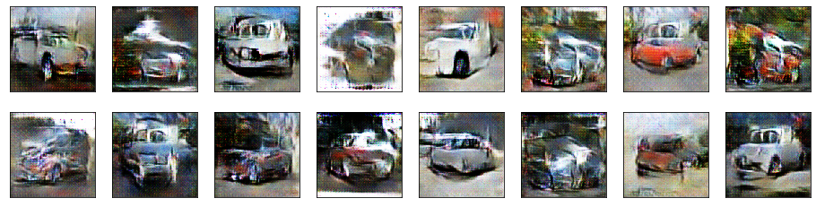

## Car image generation with GAN in pytorch

### Dataset: http://imagenet.stanford.edu/internal/car196/cars_test.tgz

#### Training Images
Input image size 128x128

#### Generated Images
Generated image size 128x128

