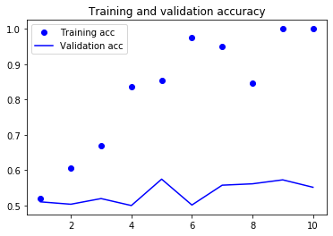
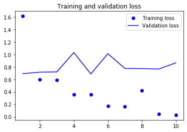
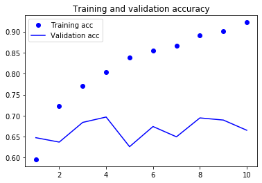
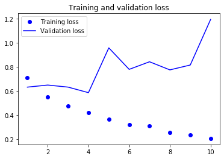

1. 200 training samples:

The notebook [Glove_Nlp200.ipynb](Glove_Nlp200.ipynb) trains the model with 200 samples 

2. 8000 training samples

The notebook [Glove_Nlp8000.ipynb](Glove_Nlp8000.ipynb) trains the model with 8000 samples 

Upload the *.tsv files here http://projector.tensorflow.org/ for embedding projections.
